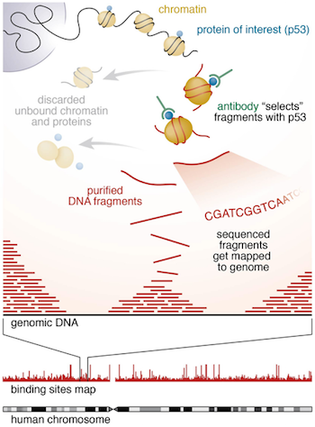
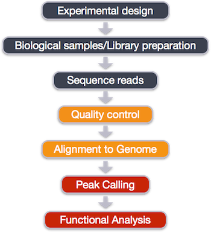
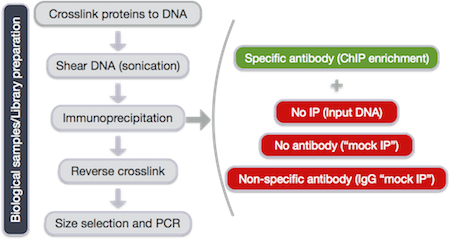

Approximate time: 30 minutes

## Learning Objectives

* understanding the experimental setup and design for ChIP-Seq experiments

## Introduction to ChIP-Seq
Chromatin immunoprecipitation (ChIP) experiments isolate the chromatin from a cell and immunoprecipitate (IP) DNA fragments bound to a protein of interest. In ChIP-Seq, the DNA fragments are sequenced, enriched regions of DNA or peaks are determined, and over-represented sequence motifs and functional annotations can be identified. 



During this session we will be performing a complete workflow for ChIP-Seq analysis, starting with experimental design and generation of the raw sequencing reads and ending with functional enrichment analyses and motif discovery.



## Experimental design and library preparation

Several steps are involved in the library preparation of protein-bound DNA fragments for sequencing: 


1. After the chromatin is isolated from the cell, proteins are cross-linked to the DNA
2. The DNA is sheared into fragments (sonication)
3. A protein-specific antibody is used to immunoprecipitate the protein-bound DNA fragments
4. The crosslink is reversed and DNA purified
5. DNA fragments are size selected and amplified using PCR


Within the DNA fragments enriched for the regions binding to a protein of interest, only a fraction correspond to actual signal. The proportion of DNA fragments containing the actual binding site of the protein depends on the **number of active binding sites, the number of starting genomes, and the efficiency of the IP**. 

In addition, when performing ChIP-Seq, some sequences may appear enriched due to the following:

- Open chromatin regions are fragmented more easily than closed regions
- Repetitive sequences might seem to be enriched (copy number inaccuracies in genome assembly)
- Uneven distribution of sequence reads across the genome

Therefore, proper controls are essential. A ChIP-Seq peak should be compared with the same region of the genome in a matched control.


The same starting material should be divided to be used for both the protein-specific IP and the control. The control sample can be generated by one of the following recommended techniques: 

- No IP (input DNA) 
- No antibody ("mock IP")
- Non-specific antibody (IgG "mock IP")



## Introduction to example data

Our goal for this session is to compare the the binding profiles of [Nanog](www.nature.com/stemcells/2009/0909/090910/full/stemcells.2009.118.html) and [Pou5f1](www.nature.com/cr/journal/v12/n5/full/7290134a.html) (Oct4). The ChIP was performed on H1 human embryonic stem cell line (h1-ESC) cells, and sequenced using Illumina GAII the data was obtained from the [HAIB TFBS ENCODE collection](http://hgdownload.cse.ucsc.edu/goldenpath/hg19/encodeDCC/wgEncodeHaibTfbs/). These 2 transcription factors are involved in **stem cell pluripotency** and one of the goals is to understand their roles, individually and together, in transriptional regulation. 

Two replicates were collected and each was divided into 3 aliquots for the following:

- Nanog IP
- Pou5f1 IP
- Control input DNA


For these 6 samples, we will be using reads from only a 32.8 Mb of chromosome 12 (chr12:1,000,000-33,800,000), so we can get through the workflow in class. 

Below is the workflow that we will be using today, similar to RNA-Seq, each step in the workflow will require the data to be in a specific type of standardized format.

	

## Set-up

Before we get started with the analysis, we need to set up our directory structure.

Login to Orchestra and start an interactive session with two cores:

```bash
$ bsub -Is -n 2 -q interactive bash
```

Change directories to the `ngs_course` directory:

```bash
$ cd ~/ngs_course
```

Create a `chipseq` directory and change directories into it:

```bash
$ mkdir chipseq

$ cd chipseq
```

Now let's setup the directory structure. In one command create folders for `raw_data`and `reference_data`:

```bash
$ mkdir -p raw_data reference_data
```

We'll also create a folder for `results` and within that folder create folders for `untrimmed_fastqc`, `trimmed`, `trimmed_fastqc`, and `bowtie2`:

```bash
$ mkdir -p results/untrimmed_fastqc results/trimmed results/trimmed_fastqc results/bowtie2
```

Finally, we will need directories for our `scripts`, `logs`, and `meta`:

```bash
$ mkdir scripts logs meta
``` 

Now that we have the directory structure created, let's copy over the data to perform our quality control and alignment, including our FASTQ files and reference data files:

```bash
$ cp /groups/hbctraining/ngs-data-analysis-longcourse/chipseq/raw_fastq/*fastq raw_data/

$ cp /groups/hbctraining/ngs-data-analysis-longcourse/chipseq/reference_data/chr12* reference_data/
```

We will be using tools within the bcbio pipeline, so please make sure bcbio is in your PATH:

```bash
$ PATH=/opt/bcbio/centos/bin:$PATH
```
or within your `.bashrc` file:

```bash
export PATH=/opt/bcbio/centos/bin:$PATH
```
***
*This lesson has been developed by members of the teaching team at the [Harvard Chan Bioinformatics Core (HBC)](http://bioinformatics.sph.harvard.edu/). These are open access materials distributed under the terms of the [Creative Commons Attribution license](https://creativecommons.org/licenses/by/4.0/) (CC BY 4.0), which permits unrestricted use, distribution, and reproduction in any medium, provided the original author and source are credited.*

