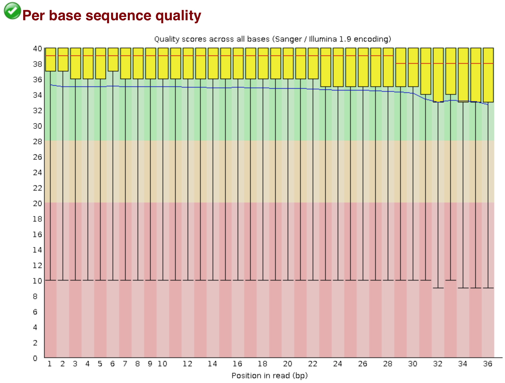

Contributors: Mary Piper, Radhika Khetani

Approximate time: 55 minutes

## Learning Objectives

* Become familiar with the Illumina sequencing technology
* Understanding how to use modules in the cluster environment
* Evaluate the quality of your sequencing data using FastQC

## Quality control of sequence reads


Now that we have our files and directory structure, we are ready to begin our ChIP-seq analysis. For any NGS analysis method, our first step in the workflow is to explore the quality of our reads prior to aligning them to the reference genome and proceeding with downstream analyses. 

### Run FastQC  

We will use FastQC as we had previously on our RNA-seq data to evaluate the quality of our sequencing reads. We will run this  on all of our files. 

Change directories to the `raw_data` folder and check the contents

```bash
$ cd ~/chipseq/raw_data 

$ ls -l
```

Before we start using any software, we either have to check if it's available on the cluster, and if it is we have to load it into our environment (or `$PATH`). On the O2 cluster, we can check for, and load packages (or modules) using the **LMOD** system. 

If we check which modules we currently have loaded, we should not see FastQC.

```bash
$ module list
```

To find the FastQC module to load we need to search the versions available:

```bash
$ module spider
```

Then we can load the FastQC module:

```bash
$ module load fastqc/0.11.3
```

Remember that FastQC will accept multiple file names as input, so we can use the `*.fq` wildcard. This time we will also add the `-o` parameter to specify where we want the results to be output.

```bash
$ fastqc *.fastq -o ~/chipseq/results/fastqc
```

> **NOTE:** We could have made this run even faster. Did you notice how each file was processed serially? How do we speed this up?


### FastQC Results
   
Let's take a closer look at the files generated by FastQC:
   
`$ ls -lh ../results/fastqc/`

#### HTML reports
The .html files contain the final reports generated by FastQC, let's take a closer look at them. Transfer the file for `H1hesc_Input_Rep1_chr12.fastq` over to your laptop via *FileZilla*.

##### Filezilla - Step 1

Open *FileZilla*, and click on the File tab. Choose 'Site Manager'.
 
	

##### Filezilla - Step 2 (you may already have this setup)

Within the 'Site Manager' window, do the following: 

1. Click on 'New Site', and name it something intuitive (e.g. O2)
2. Host: transfer.rc.hms.harvard.edu 
3. Protocol: SFTP - SSH File Transfer Protocol
4. Logon Type: Normal
5. User: training_account
6. Password: password for training_account
7. Click 'Connect'

	
	
The **"Per base sequence quality"** plot is the most important analysis module in FastQC for ChIP-seq; it provides the distribution of quality scores across all bases at each position in the reads. This information can help determine whether there were any problems at the sequencing facility during the sequencing of your data. Generally, we expect a decrease in quality towards the ends of the reads, but we shouldn't see any quality drops at the beginning or in the middle of the reads.



Based on the sequence quality plot, we see the majority of the reads have high quality, but the whiskers drop into the poor quality regions, indicating that a significant number of reads have low quality bases across the reads. The poor quality reads in the middle of the sequence would be concerning if this was our dataset, and we would probably want to contact the sequencing facility. However, this dataset was created artifically, so does not indicate a problem at the sequencing facility. Trimming could be performed from both ends of the sequences, or we can use an alignment tool that can ignore these poor quality bases at the ends of reads (soft clip). 

This is the main plot explored for ChIP-seq, but if you would like to go through the remaining plots/metrics, FastQC has a really well documented [manual page](http://www.bioinformatics.babraham.ac.uk/projects/fastqc/) with [more details](http://www.bioinformatics.babraham.ac.uk/projects/fastqc/Help/) about all the plots in the report. We recommend looking at [this post](http://bioinfo-core.org/index.php/9th_Discussion-28_October_2010) for more information on what bad plots look like and what they mean for your data. Also, FastQC is just an indicator of what's going on with your data, don't take the "PASS"es and "FAIL"s too seriously.


***
*This lesson has been developed by members of the teaching team at the [Harvard Chan Bioinformatics Core (HBC)](http://bioinformatics.sph.harvard.edu/). These are open access materials distributed under the terms of the [Creative Commons Attribution license](https://creativecommons.org/licenses/by/4.0/) (CC BY 4.0), which permits unrestricted use, distribution, and reproduction in any medium, provided the original author and source are credited.*

